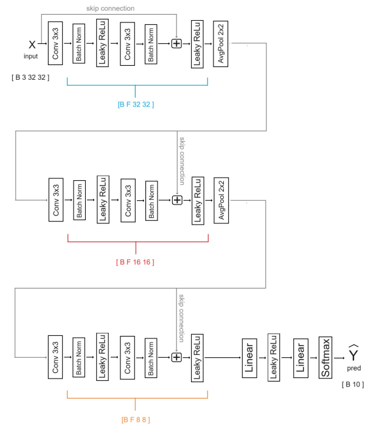

# Cifar10-ResNet3-Classifier

This project implements a **ResNet-3 style Convolutional Neural Network (CNN)** from scratch in PyTorch to classify images from the CIFAR-10 dataset.  

This repository contains a class project for *CSC 689 – Computer Vision with Deep Learning (Fall 2025)*, taught by [Dr. David Chapman](https://scholar.google.com/citations?hl=en&user=ED4QOcUAAAAJ).  

---

## Architecture

The model is a simplified ResNet-3 style network, designed to demonstrate skip connections.  

